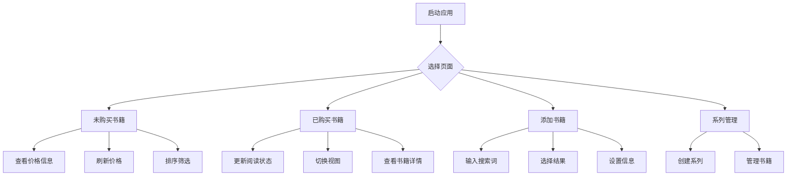

## 1. 产品概述
个人书单管理应用，专为Windows 11用户设计。帮助用户记录和管理想购买、正在阅读以及已读完的书籍，同时提供京东自营实时价格查询功能，方便用户做出购买决策。

解决个人书籍管理的痛点：避免遗忘想买的书籍、跟踪阅读进度、比较购买价格，让个人阅读生活更有序。

## 2. 核心功能

### 2.1 用户角色
本应用为个人使用，无需用户注册登录系统，数据本地存储。

### 2.2 功能模块
书单应用包含以下主要页面：
1. **未购买书籍页面**：展示想购买的书籍列表，显示实时价格信息
2. **已购买书籍页面**：展示已拥有的书籍，记录阅读状态
3. **书籍搜索页面**：通过书名或ISBN搜索添加新书籍
4. **系列管理页面**：创建和管理自定义书籍系列

### 2.3 页面详情
| 页面名称 | 模块名称 | 功能描述 |
|-----------|-------------|---------------------|
| 未购买书籍页面 | 书籍列表 | 以卡片形式展示所有未购买书籍，显示封面、书名、作者、价格、折扣信息 |
| 未购买书籍页面 | 价格刷新 | 提供全量刷新和批量刷新按钮，更新书籍价格信息 |
| 未购买书籍页面 | 排序筛选 | 支持按价格折扣、书名、作者进行排序 |
| 已购买书籍页面 | 书籍列表 | 展示已购买书籍，包含阅读状态（未开始/阅读中/已读完） |
| 已购买书籍页面 | 状态更新 | 点击书籍可更新阅读状态和记录阅读时间 |
| 已购买书籍页面 | 视图切换 | 支持按书籍、系列、作者三种维度展示 |
| 书籍搜索页面 | 搜索输入 | 输入书名或ISBN号进行模糊搜索 |
| 书籍搜索页面 | 搜索结果 | 展示匹配度最高的前5个结果，包含封面、作者、出版社信息 |
| 书籍搜索页面 | 书籍添加 | 选择搜索结果后可设置系列、购买状态等信息 |
| 系列管理页面 | 系列创建 | 创建自定义书籍系列（如"哈利波特系列"） |
| 系列管理页面 | 系列编辑 | 管理系列内书籍，支持拖拽排序 |

## 3. 核心流程

### 主要用户操作流程：
1. **添加新书籍流程**：打开应用 → 点击添加按钮 → 输入书名/ISBN → 选择匹配结果 → 设置购买状态 → 保存到对应列表
2. **价格查询流程**：在未购买页面 → 点击刷新价格 → 系统爬取京东自营价格 → 更新显示价格和折扣 → 记录更新时间
3. **阅读状态更新流程**：在已购买页面 → 点击书籍 → 选择阅读状态 → 如选择"已读完"记录完成时间 → 保存更新

## 4. 用户界面设计

### 4.1 设计风格
- **主色调**：深空蓝(#1a1a2e) + 温暖橙(#ff6b35)
- **辅助色**：浅灰(#f5f5f5)、纯白(#ffffff)
- **按钮风格**：圆角矩形，悬停有轻微阴影效果
- **字体**：系统默认字体，标题16px，正文14px，小字12px
- **布局风格**：卡片式布局，左右分栏，左侧导航右侧内容
- **图标风格**：简约线性图标，使用Tabler Icons或类似图标库

### 4.2 页面设计概述
| 页面名称 | 模块名称 | UI元素 |
|-----------|-------------|-------------|
| 未购买书籍 | 书籍卡片 | 圆角卡片，封面占2/3高度，底部显示书名作者，右上角显示折扣标签 |
| 已购买书籍 | 状态指示 | 封面下方彩色进度条，绿色(已读完)、蓝色(阅读中)、灰色(未开始) |
| 搜索页面 | 搜索框 | 顶部居中，圆角输入框，带搜索图标，支持ISBN扫码 |
| 系列管理 | 系列卡片 | 横向排列的系列封面拼贴，显示系列名称和书籍数量 |

### 4.3 响应式设计
桌面优先设计，针对Windows 11优化：
- 主窗口大小：1200x800px，支持最大化
- 左侧导航栏宽度：200px，可折叠
- 书籍卡片在不同分辨率下自适应网格布局
- 支持触摸屏操作，按钮大小适合手指点击

### 4.4 数据持久化
- 使用SQLite本地数据库存储所有书籍信息
- 支持数据导出功能，可生成分享文件
- 提供简单的数据备份和恢复机制