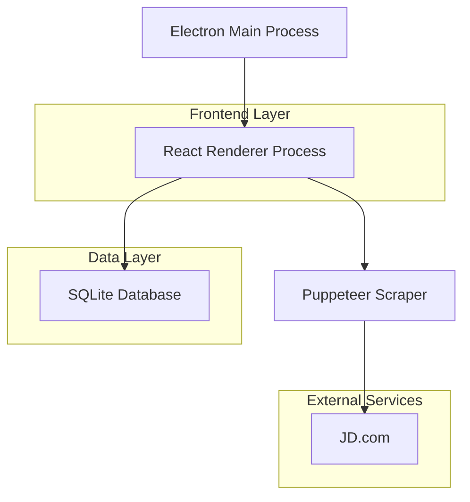
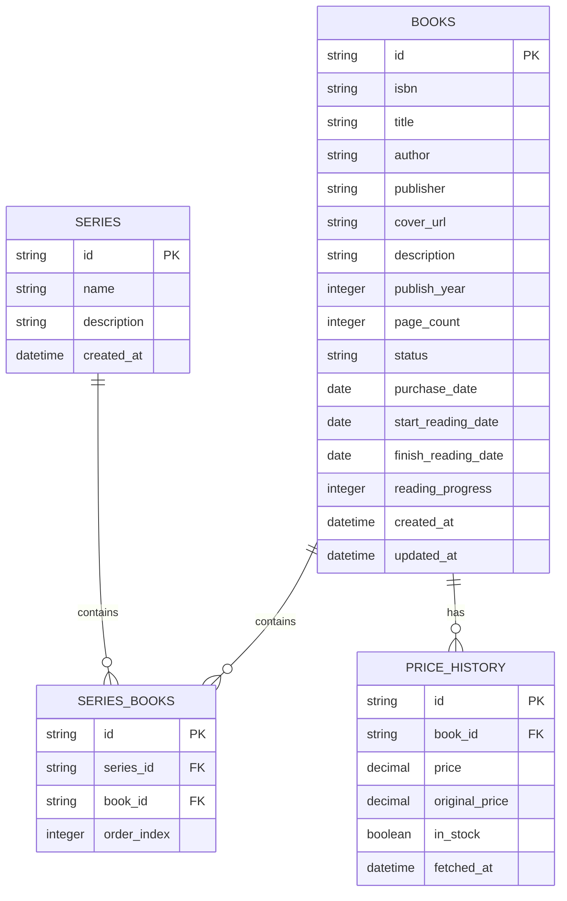
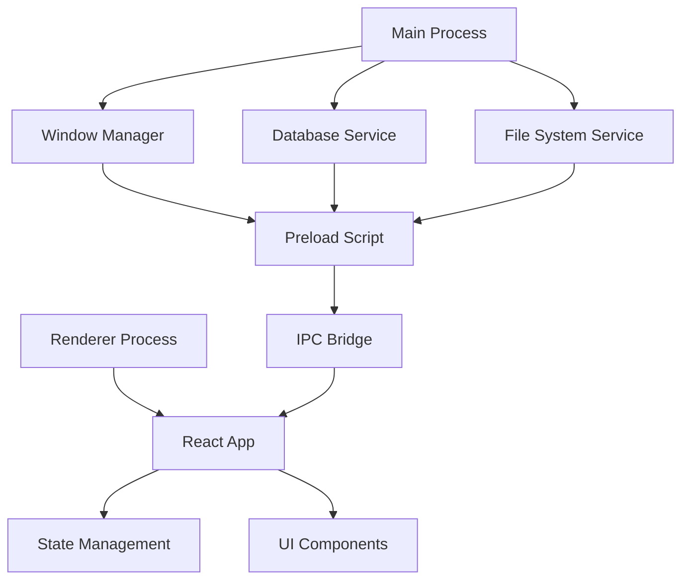

## 1. 架构设计



## 2. 技术描述

* **桌面框架**: Electron\@27 + Vite

* **前端**: React\@18 + TypeScript\@5 + TailwindCSS\@3

* **UI组件库**: shadcn/ui + Radix UI

* **数据库**: SQLite3 + better-sqlite3

* **爬虫**: Puppeteer\@21

* **状态管理**: Zustand\@4

* **构建工具**: Vite\@5 + electron-vite

* **包管理**: pnpm

## 3. 路由定义

| 路由           | 用途                  |
| ------------ | ------------------- |
| /            | 主页，显示应用概览和快速导航      |
| /unpurchased | 未购买书籍页面，显示价格信息和购买建议 |
| /purchased   | 已购买书籍页面，管理阅读状态      |
| /search      | 书籍搜索页面，添加新书籍        |
| /series      | 系列管理页面，创建和管理书籍系列    |
| /settings    | 设置页面，数据导出和备份功能      |

## 4. 核心模块设计

### 4.1 数据库模型



### 4.2 数据表定义

**书籍表 (books)**

```sql
CREATE TABLE books (
    id TEXT PRIMARY KEY,
    isbn TEXT UNIQUE,
    title TEXT NOT NULL,
    author TEXT NOT NULL,
    publisher TEXT,
    cover_url TEXT,
    description TEXT,
    publish_year INTEGER,
    page_count INTEGER,
    status TEXT CHECK (status IN ('unpurchased', 'reading', 'finished')) DEFAULT 'unpurchased',
    purchase_date DATE,
    start_reading_date DATE,
    finish_reading_date DATE,
    reading_progress INTEGER DEFAULT 0 CHECK (reading_progress >= 0 AND reading_progress <= 100),
    created_at DATETIME DEFAULT CURRENT_TIMESTAMP,
    updated_at DATETIME DEFAULT CURRENT_TIMESTAMP
);

CREATE INDEX idx_books_status ON books(status);
CREATE INDEX idx_books_author ON books(author);
```

**系列表 (series)**

```sql
CREATE TABLE series (
    id TEXT PRIMARY KEY,
    name TEXT NOT NULL UNIQUE,
    description TEXT,
    created_at DATETIME DEFAULT CURRENT_TIMESTAMP
);
```

**系列书籍关联表 (series\_books)**

```sql
CREATE TABLE series_books (
    id TEXT PRIMARY KEY,
    series_id TEXT NOT NULL,
    book_id TEXT NOT NULL,
    order_index INTEGER DEFAULT 0,
    FOREIGN KEY (series_id) REFERENCES series(id) ON DELETE CASCADE,
    FOREIGN KEY (book_id) REFERENCES books(id) ON DELETE CASCADE,
    UNIQUE(series_id, book_id)
);

CREATE INDEX idx_series_books_series ON series_books(series_id);
```

**价格历史表 (price\_history)**

```sql
CREATE TABLE price_history (
    id TEXT PRIMARY KEY,
    book_id TEXT NOT NULL,
    price DECIMAL(10,2) NOT NULL,
    original_price DECIMAL(10,2),
    discount_rate DECIMAL(5,2),
    in_stock BOOLEAN DEFAULT true,
    fetched_at DATETIME DEFAULT CURRENT_TIMESTAMP,
    FOREIGN KEY (book_id) REFERENCES books(id) ON DELETE CASCADE
);

CREATE INDEX idx_price_history_book ON price_history(book_id);
CREATE INDEX idx_price_history_fetched ON price_history(fetched_at DESC);
```

### 4.3 爬虫服务设计

**价格获取服务**

```typescript
interface PriceService {
    fetchJDPrice(isbn: string): Promise<PriceInfo>
    batchFetchPrices(isbns: string[]): Promise<Map<string, PriceInfo>>
    calculateDiscount(original: number, current: number): number
}

interface PriceInfo {
    price: number
    originalPrice: number
    discountRate: number
    inStock: boolean
    isSelfOperated: boolean
    fetchedAt: Date
}
```

**爬虫策略**

* 使用Puppeteer模拟浏览器行为

* 优先访问京东自营商品页面

* 设置合理的请求间隔（3-5秒）

* 实现错误重试机制（最多3次）

* 缓存机制：价格数据缓存24小时

### 4.4 书籍搜索API集成

**开放图书API**

* Google Books API（主要）

* Open Library API（备用）

* 豆瓣图书API（中文书籍补充）

**搜索接口设计**

```typescript
interface BookSearchService {
    searchByTitle(title: string, limit: number): Promise<BookInfo[]>
    searchByISBN(isbn: string): Promise<BookInfo | null>
    getBookDetails(id: string): Promise<BookDetails>
}

interface BookInfo {
    id: string
    title: string
    author: string[]
    publisher: string
    publishDate: string
    isbn: string
    coverUrl: string
    pageCount: number
    description: string
}
```

## 5. 应用架构细节

### 5.1 Electron进程架构



### 5.2 数据流程

1. **书籍添加**: UI输入 → 搜索API → 用户选择 → 本地存储 → 界面更新
2. **价格更新**: 用户触发 → 爬虫服务 → 数据存储 → 界面刷新
3. **状态管理**: 使用Zustand管理应用状态，支持时间旅行调试

### 5.3 性能优化

* 虚拟滚动处理大量书籍列表

* 图片懒加载和缓存策略

* 数据库查询优化和索引设计

* 爬虫请求队列和并发控制

## 6. 部署和分享

### 6.1 打包配置

* 使用electron-builder打包Windows安装包

* 支持自动更新机制

* 生成便携版（无需安装）

### 6.2 数据分享

* 导出功能：生成JSON或CSV文件

* 只读分享：生成加密的数据文件

* 分享查看器：轻量级的查看应用

